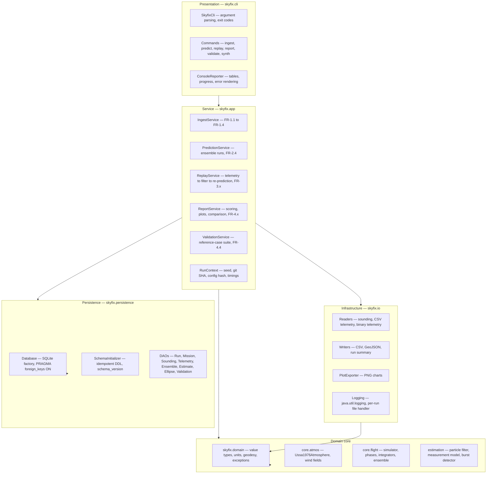
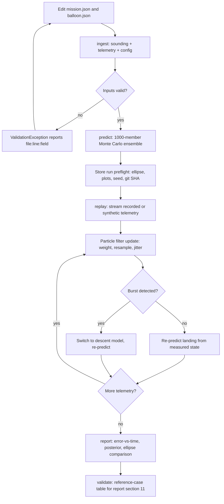
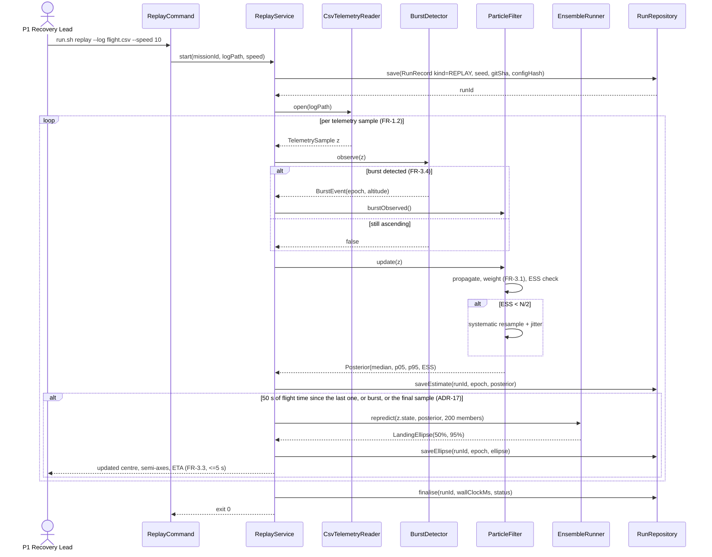
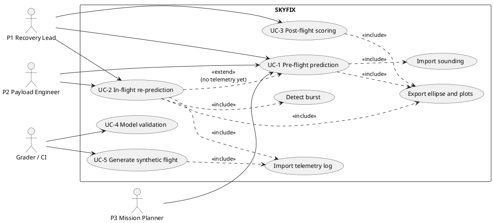

# SKYFIX — Blueprint

Authoritative specification. Every ID below (`FR-`, `NFR-`, `UC-`, `ADR-`, `T-`, `PL-`, `SC-`,
`DS-`, `O`) is stable and is cross-referenced by the course report. Do not renumber.

Course: CSE2006 Programming in Java · VIT Bhopal University · individual submission ·
budget 60 h over 10 weeks.

---

## 1 · Conventions

SI units internally; conversion only at the edges in `domain/Units.java`. Epochs UTC,
stored ISO-8601. Horizontal position WGS-84 geodetic lat/lon; altitude geometric above MSL,
with the geoid–ellipsoid offset applied once at ingest as a configured constant
(verify: EGM96 undulation for the launch region). Winds in local ENU. Every state record
carries its integrator, step size and seed.

## 2 · Problem statement

Balloon recovery teams plan the chase from a single pre-flight prediction computed with
catalogue values for free lift, drag coefficient and burst diameter — each known only to
within tens of percent — and a wind forecast already hours old at launch. The prediction is
a point with no uncertainty, nothing corrects it when the real ascent diverges, and payload
duty cycles keyed to altitude are scheduled against a profile the balloon does not fly.
Current workaround: re-run an online predictor by hand mid-chase, still with nominal
parameters. SKYFIX ingests replayed telemetry, estimates the flight's actual parameters
while it is airborne, and re-predicts the landing point as a confidence ellipse.

**Distinguishing idea:** existing predictors *assume* the flight parameters; SKYFIX
*estimates* them from the flight itself and quantifies what it does not know.

## 3 · Objectives

| ID | Objective | Measure |
|----|-----------|---------|
| O1 | Offline atmosphere and flight model in hand-written Java | USSA-1976 within 0.1% for T, p, ρ at 25 altitudes 0–47 km (T-V1); ascent rate within 2% of analytic at 5 altitudes (T-V2) |
| O2 | Dispersed footprint, not a point | 1,000-member ensemble + 50/95% ellipse in ≤30 s on 4 cores (T-P1) — **met, 5,836 ms median** |
| O3 | Estimate flight parameters from telemetry | Over 20 synthetic flights, posterior median recovers ascent Cd within 5% and burst altitude within 500 m in ≥18 runs (T-V5) |
| O4 | Prove the in-flight update is worth it | Median landing-error reduction ≥30% vs the frozen pre-flight prediction (T-V6) |
| O5 | Reproducible by a grader | Fresh clone → `mvnw test` green offline; ≥80% JaCoCo on core packages; identical seed → identical ellipse (T-R1) |
| O6 | Documentation alongside code | 7 diagrams, dataset description, model rationale, evaluation methodology committed by their scheduled weeks |

## 4 · Scope

**In:** single latex sounding balloon, launch → burst → parachute descent; 1-D vertical
dynamics with horizontal advection by an interpolated wind field; USSA-1976 to 86 km;
offline sounding files; recorded/synthetic telemetry replay; Monte Carlo dispersion;
particle-filter estimation; SQLite persistence; CLI with PNG/CSV/GeoJSON export.

**Out:** live radio or serial ingest (replay only); mandatory forecast downloads; zero-pressure
and superpressure float profiles; envelope elasticity and aerodynamic lift; 3-D turbulence;
terrain elevation lookup (constant ground elevation; SRTM is Stretch); chase-vehicle routing;
GUI (Swing shell is Stretch); multi-user or networked deployment.

## 5 · Target users

| Persona | Goal | Pain today |
|---|---|---|
| P1 Recovery lead (45 km mission) | Commit to a road 40+ min before touchdown, know the odds | One dot from a web predictor; no spread, no update as the flight diverges |
| P2 Payload/flight-computer engineer (HabSat, ~30 km) | Schedule instrument duty cycles against the profile actually flown | Timing set against nominal ascent rate; a 1 m/s error puts sampling windows at wrong altitudes |
| P3 Mission planner | Pick a launch site whose 95% footprint avoids water, cities, restricted airspace | Footprint argued qualitatively; no number for a notification (verify: DGCA/AAI requirements for unmanned free balloons in India) |

## 6 · Functional requirements

### M1 — Ingest, Validation & Replay

- **FR-1.1 Sounding import** — in: radiosonde file + station metadata → parse levels, convert
  to SI, sort by geopotential height, reject non-monotonic or out-of-range levels → `Sounding`
  + N `SoundingLevel` rows. **Accept:** 1,200-level file in ≤2 s; every rejected line reported
  as `file:line:reason`; re-import idempotent via unique (station, epoch, source).
- **FR-1.2 Telemetry ingest & replay** — in: CSV (UTC, lat, lon, GPS alt, pressure, temperature)
  or K-SAT binary packet dump → validate, de-duplicate by packet id, derive pressure altitude,
  order by time → `TelemetrySeries` + replay iterator with speed factor. **Accept:** 10,000
  samples in ≤3 s; out-of-order timestamps and duplicate packet ids counted and surfaced,
  never silently dropped.
- **FR-1.3 Configuration validation** — in: `balloon.json` + `mission.json` → range and physics
  checks → validated `BalloonConfig`. **Accept:** mass ≤ 0, burst diameter ≤ launch diameter,
  Cd outside 0.1–2.0 each raise `ValidationException` naming the field; one negative test per
  rule (T-E1).
- **FR-1.4 Synthetic flight generator** — in: truth parameters + wind field + noise spec + seed
  → forward-simulate, add GPS/pressure noise and dropouts → telemetry file + stored truth.
  **Accept:** same seed reproduces a byte-identical file; stored truth is what T-V5/T-V6 score
  against.

### M2 — Flight Model & Ensemble

- **FR-2.1 Atmosphere** — in: geometric altitude 0–86 km → USSA-1976 piecewise layers with base
  temperature, lapse rate, pressure recursion → T, p, ρ, speed of sound. **Accept:** within 0.1%
  of published tables at 25 altitudes (T-V1); above 86 km raises `ModelDomainException`.
- **FR-2.2 Wind field query** — in: sounding levels + (time, altitude) → linear interpolation of
  u, v in geopotential height, nearest-in-time sounding, hold-last-value above the top level →
  wind vector + `extrapolated` flag. **Accept:** node altitudes return node values exactly; any
  extrapolated query sets the flag in the state record and increments a run-summary counter.
- **FR-2.3 Flight integration** — in: `BalloonConfig` + `WindField` + `SimSettings(dt, integrator,
  tEnd)` → gas-law envelope expansion, vertical ODE of buoyancy − weight − drag, horizontal
  advection, burst when diameter ≥ burst diameter, parachute descent → `StateHistory` + landing
  point. **Accept:** RK4 and RKF45 agree within 50 m of landing position at every stable dt ≤ 1 s
  (T-V3); `dt ≤ 0` or `tEnd ≤ t0` raises `ValidationException` naming the field; a step outside the
  integrator's stability region raises `ConvergenceException` naming the largest stable step
  (ADR-13) rather than returning a plausible but wrong landing point.
- **FR-2.4 Monte Carlo ensemble** — in: nominal config + dispersion spec (free lift, ascent Cd,
  burst diameter, parachute Cd, wind-error scale) + N + seed → Latin-hypercube sample, run on a
  fixed thread pool, aggregate by covariance eigen-decomposition → landing scatter, mean,
  50/95% ellipse, CSV/GeoJSON. **Accept:** N = 1,000 in ≤30 s on 4 cores (T-P1); identical seed
  → identical semi-axes and orientation to 1e-9 (T-R1).

### M3 — In-flight Estimator

- **FR-3.1 Measurement model** — in: predicted state + telemetry sample → Gaussian
  log-likelihood on altitude, vertical rate, horizontal position with configurable σ per channel.
  **Accept:** likelihood maximised at injected truth, monotone decreasing with induced error in
  each channel.
- **FR-3.2 Particle filter update** — in: particle set over θ = (free lift, ascent Cd,
  burst-diameter scale, parachute Cd) + telemetry to t → propagate, weight, systematic
  resampling when ESS < N/2, kernel jitter → posterior + per-update statistics persisted.
  **Accept:** T-V5 thresholds; ESS, resample count and jitter logged at each update.
- **FR-3.3 Re-prediction on update** — in: posterior + current measured state → forward ensemble
  from the measured state → ellipse tagged with the update epoch. **Accept:** one 200-member
  re-prediction in ≤5 s, issued no more often than once per 50 s of flight time, so a 1 Hz log
  replayed at 10× drops no updates (T-P2). The two clauses go together and the interval is derived
  from the budget, not chosen: at 10× a second of flight time affords 100 ms, so a 5 s
  re-prediction is affordable once per 50 s of flight. A *per-sample* re-prediction under this
  budget is arithmetically impossible — see ADR-17, which corrects the §8 sequence diagram.
- **FR-3.4 Burst detection** — in: replay stream → sign change in smoothed vertical rate
  sustained over k samples → burst event, switch to descent model. **Accept:** detected within
  5 s and 150 m with GPS noise σ = 10 m; zero false positives across a 3 s dropout (T-E2).

### M4 — Comparison, Reporting & Validation

- **FR-4.1 Prediction error scoring** — in: run ids (frozen + each re-prediction) + actual landing
  point → haversine error per update → error-vs-time table + median reduction for O4.
  **Accept:** matches a hand-computed haversine within 1 m on a fixture pair.
- **FR-4.2 Plot export** — in: run id → PL-1…PL-4 PNGs in `out/run-<id>/`. **Accept:** 4 plots in
  ≤5 s, deterministic filenames, non-empty asserted by test.
- **FR-4.3 Run comparison** — in: two or more run ids → landing coordinates, ellipse semi-axes and
  area, 95% containment, wall-clock, seed, git SHA, config hash → console table + CSV.
  **Accept:** any stored run re-materialises from the database without re-simulating (T-D1).
- **FR-4.4 Validation command** — in: `validate` → full reference-case suite → model vs reference
  vs tolerance vs pass/fail. **Accept:** exits non-zero if any tolerance is breached; its output
  is the artefact pasted into report §10 and §11.

**Use cases:** UC-1 pre-flight prediction · UC-2 in-flight re-prediction (primary) ·
UC-3 post-flight scoring · UC-4 model validation · UC-5 synthetic flight generation.

## 7 · Non-functional requirements

| ID | Category | Target | Verification |
|----|----------|--------|--------------|
| NFR-1 | Performance | 1,000-member ensemble to landing ≤30 s wall-clock, 4-core laptop, JDK 21, warm JVM, ≤2 GB heap | T-P1 (3-run median), T-P2 — **met: 5,836 ms median** (5,232 / 5,836 / 5,862) on 4 cores at the 0.25 s step ADR-13 requires, against a sounding-interpolated wind field; T-P2 **1,054 ms** against 5 s. Measured with coverage instrumentation off (see ADR-15) |
| NFR-2 | Reliability | Atmosphere within 0.1% of USSA-1976 at 25 points; RK4 vs RKF45 landing within 50 m; mass/volume bookkeeping drift <1e-6 relative | T-V1–T-V4; `validate` exits non-zero on breach |
| NFR-3 | Error handling | Every external input failure produces a typed exception carrying `file:line:field`; a 10,000-line corrupted sounding and a truncated binary dump both exit cleanly, non-zero code, zero stack traces shown to the user | T-E1, T-E2, T-E3 |
| NFR-4 | Maintainability | ≥80% JaCoCo line coverage on `core.*` and `estimation`; 10 packages, no cycles; no concatenated SQL | T-M1 (build gate), T-S1 (source scan) |
| NFR-5 | Logging & monitoring | Every run persists git SHA, seed, config hash, integrator, step, member count, wall-clock, host cores; INFO per phase, DEBUG per member, WARN on wind extrapolation or resample storms | T-R1, log inspection |
| NFR-6 | Usability | Fresh clone → rendered footprint PNG in ≤3 commands and ≤5 minutes, Windows and Linux, no network | T-U1 (scripted clean run) |

Security is a constraint, not an inflated NFR: no credentials stored, no network on the default
path, `PreparedStatement` everywhere — enforced by T-S1.

## 8 · Architecture

Dependency rule: `cli → app → {core.*, estimation, persistence, io} → domain`; `domain` depends
on nothing; the graph is acyclic (NFR-4).



### Design patterns

| Pattern | Where | Why |
|---|---|---|
| Strategy | `Integrator` (RK4/RKF45), `AtmosphereModel`, `WindField`, `MeasurementModel`, `Resampler` | T-V1 and T-V3 compare implementations on the same flight — the comparison *is* the validation |
| Factory Method | `IntegratorFactory`, `WindFieldFactory` | Config names a model as a string; the factory is the single place an unknown name becomes a `ValidationException` |
| Template Method | `FlightPhase.step()` fixes query-atmosphere → forces → integrate → exit check; subclasses supply `netForce()` and `isComplete()` | Burst is a phase switch, not a special case scattered through the simulator |
| Builder | `BalloonConfig`, `SimSettings` | 9 correlated parameters with cross-field rules; validation once in `build()`, result immutable so 1,000 threads share it safely |
| DAO / Repository | 8 DAOs behind `Repository<T,K>` | All SQL in one layer so T-S1 can assert no concatenation exists |
| Observer | `ReplayService` publishes to `RunListener`s (console, DB, plot collector) | Adding the Stretch Swing view means adding a listener, not touching FR-3.x |
| Command | One class per CLI subcommand returning an exit code | Maps FR groups 1:1 to classes; scriptable surface for T-U1 |

**Rejected:** Singleton for the database connection — hides lifetime, breaks per-test isolation.
`Database` is constructed in `Main` and injected.

### Workflow (docs/diagrams/workflow.svg)



### Sequence, UC-2 primary (docs/diagrams/sequence-uc2.svg)



### Use case (docs/diagrams/uc-skyfix.puml)



**Class diagram** (`docs/diagrams/class.svg`) is generated from the class inventory in §11 —
core domain plus the interface families `AtmosphereModel`, `WindField`, `Integrator`,
`MeasurementModel`, `Resampler`, `Repository<T,K>`, and the `FlightPhase` hierarchy.
Due by the `v0.1-mvp` tag and regenerated whenever those types change.

## 9 · Storage

Schema: `src/main/resources/schema/V1__init.sql` (copy shipped at `docs/schema/V1__init.sql`).
13 tables: `schema_version`, `mission`, `balloon_config`, `sounding`, `sounding_level`,
`flight_log`, `telemetry_sample`, `run`, `ensemble_member`, `run_state`, `estimate`,
`landing_ellipse`, `validation_result`.

Physics is enforced in the schema, not only in Java: `burst_diameter_m > launch_diameter_m`,
`ascent_cd BETWEEN 0.1 AND 2.0`, `p05 <= median <= p95`, `semi_major_m >= semi_minor_m`,
`pressure_pa > 0`, `temperature_k BETWEEN 150 AND 340`.

Retention: `run_state` is written for the nominal member plus a configurable sample of the
ensemble (default 20), so a 1,000-member run stores ~40k rows rather than 2M. The full landing
set always lives in `ensemble_member`.

## 10 · Computation

### Datasets

| ID | Source | Format | Access | Preprocessing | Offline fallback |
|---|---|---|---|---|---|
| DS-1 | University of Wyoming upper-air archive (verify: terms, exact text layout) | fixed-width text, 60–150 levels | free, no key (verify:) | parse to SI, drop levels missing wind, sort by height, reject non-monotonic | 3 cached soundings committed in `data/soundings/` |
| DS-2 | NOAA IGRA v2 (verify: station-file naming, access) | fixed-width per-station | public domain (verify:) | as DS-1 plus station/epoch filter | optional; DS-1 covers all tests |
| DS-3 | US Standard Atmosphere 1976 reference tables | CSV, 25 rows | public, US Government document | none — used verbatim as the T-V1 oracle | `data/reference/ussa1976.csv` |
| DS-4 | Totex/Kaymont burst-diameter and nominal-lift tables (verify: datasheet figures) | CSV, hand-entered with a `source` column | manufacturer spec sheet | g→kg, in→m | `data/reference/balloons.csv` |
| DS-5 | HabSat bench logs, K-SAT RFM95W packet dumps | CSV / binary | mine, with team permission | de-duplicate by packet id, derive pressure altitude, flag GPS dropouts | 1 short bench log ships |
| DS-6 | FR-1.4 synthetic generator, seeded | CSV + `truth_json` | generated locally | none | **primary evaluation set** — 20 flights regenerate byte-identically from `data/truth/seeds.csv` via `run.sh synth`. **Built:** burst altitudes span 24.6–31.8 km and ascent Cd 0.30–0.67. The ~11 MB of telemetry is deliberately *not* committed; the seed file is the dataset definition and `data/truth/truth-manifest.csv` summarises the truth |
| DS-7 | SRTM/ASTER tiles (verify: access) — Stretch only | GeoTIFF | — | resample to coarse grid | constant ground elevation from `mission.json` |

**State plainly in the report:** no real 30 km or 45 km flight log exists yet, so O3/O4 are
scored on DS-6 with DS-5 as a single real-hardware replay. When HabSat flies, the same commands
score it with no code change.

### Model selection rationale

| Choice | Candidates | Selected | Trade-off |
|---|---|---|---|
| Atmosphere | Exponential · **USSA-1976** · NRLMSISE-00 | USSA-1976 | **Measured** by `AtmosphereComparisonTest`: a best-fit single-scale-height exponential (H = 7.64 km) is 20.4% off in density at the tropopause and up to 48.3% off by 35 km. Buoyancy and drag are both linear in density, so that passes almost directly into ascent rate — an order of magnitude outside the 2% T-V2 tolerance. NRLMSISE-00 needs space-weather indices (network) and only matters above ~90 km |
| Wind | Constant · **single sounding, linear in height, nearest in time** · GFS GRIB2 4-D | Sounding interpolation | GRIB2 parsing is a term project by itself and needs a download; the systematic error (profile assumed to hold along 400 km) is absorbed into the `wind_scale` dispersion and reported, not hidden |
| Ascent drag | **Constant Cd** · Re-dependent correlation · CFD | Constant Cd, estimated | Balloon Re is 1e5–1e6 where sphere Cd is roughly flat (verify: drag-crisis Re range); more importantly Cd is *estimated* from telemetry, so a fitted constant beats an unfitted correlation |
| Burst | **Diameter threshold × estimated scale** · stress-based envelope model | Threshold + `burst_scale` | Stress model needs latex material data I do not have; the scale factor makes the manufacturer figure a prior rather than a truth |
| Descent | **Constant-Cd parachute** · Mach/Re-dependent Cd | Constant, estimated | Descent above 25 km is drag-limited and fast; landing point is dominated by wind advection in the last 10 km |
| Integrator | Euler · **RK4** · RKF45 · symplectic | RK4 default at dt = 0.25 s, RKF45 available | Euler needs dt < 0.1 s for the same accuracy and kills NFR-1; RKF45 gives the error estimate and the T-V3 cross-check; symplectic buys nothing for a dissipative system. **Measured (ADR-13):** the step is bounded by absolute stability on the parachute descent, not by accuracy — drag damping reaches ~3.6 /s near the ground, and RK4's real-axis limit of 2.785 caps the step at ~0.77 s there |
| Estimator | EKF · UKF · **particle filter** · batch least squares | Bootstrap PF with jitter | Burst is a hard discontinuity and the pre-burst posterior can be bimodal; no Jacobians needed; batch LSQ cannot answer mid-flight. Cost capped at 500 particles to hold FR-3.3 |
| Sampling | **Latin hypercube** · plain MC · Sobol | LHS over 5 parameters | LHS guarantees marginal coverage by construction: **measured**, plain MC leaves more than a fifth of the strata unvisited at N = 1,000, while LHS fills every one exactly once (T-U-LHS). **The "~400 members against plain MC's ~1,500" claim is measured and retired at ~2x rather than 3.75x** — across seven independent seeds per point the seed-to-seed scatter of the fitted 95% semi-major axis is lower for LHS at every count from 100 to 3,200, by about 1.4x, and since scatter falls as N^-0.5 that is about half the members for the same stability (`SamplerConvergenceTest`, ADR-14 carries the table) |

### Evaluation methodology

| Test | Case | Tolerance |
|---|---|---|
| T-V1 | USSA-1976 T, p, ρ at 25 altitudes 0–47 km (DS-3) | ≤0.1% relative each |
| T-V2 | Analytic buoyancy–drag terminal ascent rate at 5 altitudes | ≤2% |
| T-V3 | RK4 vs RKF45 landing separation, at every **stable** dt ≤ 1 s, same seed (0.5, 0.25, 0.125 s) | ≤50 m — **measured 0.003 m, 0.000 m, 0.000 m**. See ADR-13: RK4 at dt = 1 s is outside its absolute-stability region for the last few km of descent and is refused by the simulator |
| T-V4 | Gas-law mass/volume invariant over a full flight | <1e-6 relative drift |
| T-V5 | Parameter recovery, 20 DS-6 flights with known truth | Cd ≤5%, burst altitude ≤500 m, in ≥18/20 |
| T-V6 | Live vs frozen landing error, same 20 flights | median reduction ≥30% |
| T-V7 | 95% ellipse empirical containment | 0.90–0.98 — **the fitter is calibrated**: against a synthetic Gaussian cloud the 50/90/95% ellipses contained 49.9/90.0/95.1% (T-U-ELLIPSE). T-V7 repeats this against real ensembles, where the Gaussian assumption may not hold |
| T-E2 | Burst detection, σ=10 m GPS noise, 3 s dropout | ≤5 s, ≤150 m, 0 false positives — **met across six seeds: time error 0.0–2.3 s, altitude error 1–36 m, no false positive across dropout runs of 3 and 5 samples** |
| T-D2 | Real-hardware replay of the DS-5 bench log | completes, no NaN, dropouts reported |

**Plots:** PL-1 altitude vs time with ensemble band and telemetry overlay · PL-2 landing scatter
with 50/95% ellipses and truth marker · PL-3 posterior median and 5–95% band per parameter vs
update epoch with truth lines · PL-4 landing error vs time, frozen vs live · PL-5 ellipse
calibration (nominal vs empirical coverage) · PL-6 USSA residual % vs altitude.

## 11 · Class inventory

Package root `com.skyfix`. Tiers: MVP (W1–W4) · Target (W5–W9) · Stretch (only if W10 is quiet).

| Package | Classes | Tier |
|---|---|---|
| `cli` | `SkyfixCli`, `IngestCommand`, `PredictCommand`, `ValidateCommand`, `ConsoleReporter` | MVP |
| `cli` | `ReplayCommand`, `ReportCommand`, `SynthCommand` | Target |
| `app` | `IngestService`, `PredictionService`, `ValidationService`, `RunContext` | MVP |
| `app` | `ReplayService`, `ReportService`, `RunListener`, `ReplayEvent` | Target |
| `domain` | `GeoPoint`, `BalloonState`, `BalloonConfig` (Builder), `FlightParameters`, `SimSettings`, `DispersionSpec`, `StateHistory`, `Ensemble`, `LandingEllipse`, `TelemetrySample`, `Units` (overloaded converters), `Geodesy`, `Phase` | MVP |
| `domain` | `Posterior` | Target |
| `domain.error` | `SkyfixException`, `ValidationException`, `DataFormatException`, `ModelDomainException`, `PersistenceException` | MVP |
| `domain.error` | `ConvergenceException` | Target |
| `core.atmos` | `AtmosphereModel`, `Ussa1976Atmosphere`, `ExponentialAtmosphere`, `WindField`, `SoundingWindField`, `ConstantWindField`, `WindFieldFactory` | MVP |
| `core.atmos` | `SyntheticWindField` | Target |
| `core.flight` | `Integrator`, `Rk4Integrator`, `IntegratorFactory`, `FlightPhase` (abstract), `AscentPhase`, `DescentPhase`, `FlightSimulator`, `EnsembleRunner`, `DispersionSampler`, `EllipseFitter` | MVP |
| `core.flight` | `Rkf45Integrator` | Target |
| `estimation` | `ParticleFilter`, `Particle`, `MeasurementModel`, `GaussianMeasurementModel`, `Resampler`, `SystematicResampler`, `BurstDetector` | Target |
| `persistence` | `Database`, `SchemaInitializer`, `Repository<T,K>`, `RunDao`, `MissionDao`, `SoundingDao`, `TelemetryDao`, `EnsembleDao`, `EstimateDao`, `EllipseDao`, `ValidationDao` | MVP |
| `io` | `SoundingReader`, `WyomingSoundingReader`, `CsvTelemetryReader`, `CsvWriter`, `GeoJsonWriter`, `ConfigLoader` | MVP |
| `io` | `BinaryTelemetryReader`, `SyntheticFlightWriter`, `PlotExporter` | Target |
| `io` | `IgraSoundingReader` | Stretch |

74 types across 10 packages; 31 are substantive modelling classes. Report the honest breakdown
rather than a single inflated number.

### Java-concept coverage (course syllabus)

Constructors and Builders (`BalloonConfig`) · classes and objects (`domain`) · method overloading
(`Units.toMetres`, `FlightSimulator.run`/`runFrom`) · inheritance and `super`
(`SkyfixException` hierarchy, `FlightPhase`) · overriding (`netForce`, `getMessage`) · runtime
polymorphism (`Integrator`, `WindField` via factory) · arrays (USSA layers, sounding arrays with
binary search, particle arrays) · abstract classes (`FlightPhase`) · interfaces (8 of them) ·
multithreading (`EnsembleRunner`, parallel particle propagation) · JDBC (8 DAOs, batch inserts,
transactions) · byte streams (`BinaryTelemetryReader` + CRC) · character streams (sounding, CSV,
GeoJSON) · packages (10, acyclic) · exception handling (6 types, try-with-resources, chaining) ·
strings (fixed-width parsing, config hashing) · collections and generics (`Repository<T,K>`,
`Iterable<BalloonState>`, `ArrayDeque`, `EnumMap`).

**GUI is deliberately absent** — no GUI appears in the lab record, so the deliverable is a CLI
with exported PNG charts (ADR-8). A Swing `RunListener` view stays in Stretch.

## 12 · Error handling

```
SkyfixException (checked root; carries Map<String,String> context + optional file/line)
├── ValidationException      — user input violates a stated rule          → exit 2, WARN
├── DataFormatException      — file unparseable at file:line              → exit 3, WARN/ERROR
├── ModelDomainException     — model queried outside its valid range      → exit 4, WARN
├── ConvergenceException     — solver or filter failed to converge        → exit 5, ERROR
└── PersistenceException     — wraps SQLException with statement context  → exit 6, SEVERE
```

Unexpected `RuntimeException` → exit 70, SEVERE, full trace to `out/run-<id>/error.log`, user
sees a one-line pointer. Example messages:
`Invalid balloon.json: burst_diameter_m (1.20) must exceed launch_diameter_m (1.60)` ·
`VABB_2024-01-15_00Z.txt:143: wind_dir "///" is not numeric — 3 of 128 levels rejected`.

A single bad *member* never kills a run (discard, WARN, ERROR if >1% fail); a single bad
*config* always does.

## 13 · Test plan

**Unit:** T-U-ATMOS (layer continuity, monotone pressure, ceiling exception) · T-U-WIND
(node-exact, hold-above-top, extrapolation flag) · T-U-INTEG (`y' = -ky` vs analytic, ≤1e-6
relative over 100 steps) · T-U-GEO (haversine vs 5 hand-computed pairs within 1 m, bearing
wraparound) · T-U-ELLIPSE (recovers known semi-axes within 2% from a synthetic correlated
cloud) · T-U-LHS (each stratum occupied exactly once per dimension) · T-U-BUILDER (one test per
cross-field rule) · T-U-LIKELIHOOD (maximised at truth, monotone in each channel).

**Validation:** T-V1…T-V7 per §10.

**Negative and edge:** T-E1 malformed config matrix (9 rules) · T-E2 burst detection under noise
and dropout · T-E3 corrupted sounding and truncated binary dump exit cleanly · T-E4 zero wind,
zero free lift, burst diameter reached at t=0 · T-E5 duplicate packet ids and out-of-order
timestamps counted, not dropped.

**DB integration (temp-file SQLite per test):** T-D1 save → close → re-materialise → compare ·
T-D2 real DS-5 bench log end-to-end · T-D3 FK cascade · T-D4 failed batch rolls back with zero
partial rows · T-S1 source scan for concatenated SQL.

**Performance (`@Tag("perf")`, profile `perf`):** T-P1 1,000 members ≤30 s · T-P2 200-member
re-prediction ≤5 s · T-P3 sounding ingest ≤2 s · T-P4 10,000-sample telemetry ≤3 s ·
T-R1 same seed → identical ellipse to 1e-9 across two JVM runs · T-U1 clean-clone run in ≤3
commands with no network.

**Coverage:** JaCoCo gate 80% line on `core.*` and `estimation` (build fails below), 60% overall;
`cli` and `io` exempt from the strict gate, covered by T-U1 and T-E3.

### Traceability

| FR / NFR | Classes | Tests |
|---|---|---|
| FR-1.1 | `WyomingSoundingReader`, `SoundingDao`, `IngestService` | T-U-WIND, T-E3, T-P3, T-D1 |
| FR-1.2 | `CsvTelemetryReader`, `BinaryTelemetryReader`, `TelemetryDao` | T-E5, T-P4, T-D2 |
| FR-1.3 | `BalloonConfig.Builder`, `ConfigLoader`, factories | T-U-BUILDER, T-E1 |
| FR-1.4 | `SyntheticFlightWriter`, `DispersionSampler` | T-R1, T-V5 (data source) |
| FR-2.1 | `Ussa1976Atmosphere` | T-U-ATMOS, **T-V1** |
| FR-2.2 | `SoundingWindField`, `WindFieldFactory` | T-U-WIND, T-E4 |
| FR-2.3 | `FlightSimulator`, `FlightPhase`, `AscentPhase`, `DescentPhase`, integrators | T-U-INTEG, **T-V2**, **T-V3**, **T-V4** |
| FR-2.4 | `EnsembleRunner`, `DispersionSampler`, `EllipseFitter`, `EnsembleDao` | T-U-LHS, T-U-ELLIPSE, **T-P1**, T-R1 |
| FR-3.1 | `GaussianMeasurementModel` | T-U-LIKELIHOOD |
| FR-3.2 | `ParticleFilter`, `SystematicResampler`, `EstimateDao` | **T-V5**, T-E4 |
| FR-3.3 | `ReplayService`, `EnsembleRunner`, `EllipseDao` | **T-P2**, **T-V7** |
| FR-3.4 | `BurstDetector` | **T-E2** |
| FR-4.1 | `ReportService`, `Geodesy` | T-U-GEO, **T-V6** |
| FR-4.2 | `PlotExporter` | T-U1 |
| FR-4.3 | `ReportService`, `RunDao` | **T-D1** |
| FR-4.4 | `ValidationService`, `ValidationDao` | T-V1…T-V7 aggregate |
| NFR-1 | `EnsembleRunner`, `ParticleFilter` | T-P1, T-P2 |
| NFR-2 | atmosphere, integrators, simulator | T-V1–T-V4 |
| NFR-3 | exception hierarchy, `SkyfixCli` handler | T-E1, T-E2, T-E3 |
| NFR-4 | package structure, DAO layer | T-M1, T-S1 |
| NFR-5 | `RunContext`, `RunDao`, logging config | T-R1, T-D1 |
| NFR-6 | `scripts/run.*`, README, `ConsoleReporter` | T-U1 |

## 14 · Design decisions

| ID | Decision | Alternatives | Rationale | Consequence |
|---|---|---|---|---|
| ADR-1 | USSA-1976 atmosphere | exponential; NRLMSISE-00 | Offline, closed-form, published table becomes the T-V1 oracle | Hard ceiling at 86 km → `ModelDomainException` |
| ADR-2 | SQLite + hand-written DAOs | H2; MySQL; JPA/Hibernate | Grader must see my JDBC and my SQL; single file, zero install for T-U1 | I own migrations; `run_state` sampled, not exhaustive |
| ADR-3 | Bootstrap particle filter | EKF; UKF; batch LSQ | Burst is a hard switch, pre-burst posterior can be bimodal, no Jacobians needed | O(N × forward-step) per update; capped at 500 particles |
| ADR-4 | Replay-only telemetry ingest | live serial; UDP listener | A grader with no ESP32 must still exercise UC-2; replay makes the estimator deterministic and testable | Live flight needs a thin adapter writing the same CSV contract — named in §14 Future Enhancements |
| ADR-5 | `ExecutorService` fixed pool, immutable state | parallel streams; single-threaded | Syllabus requires multithreading and the grader should see pool lifecycle, futures, shutdown | I own shutdown and `Future.get()` exception unwrapping |
| ADR-6 | One derived seed per member (`SplittableRandom.split()`) | shared synchronised `Random`; `ThreadLocalRandom` | A shared RNG makes results depend on thread interleaving and breaks T-R1 | Member *k* reproducible in isolation — debugging an outlier is trivial |
| ADR-7 | Single-sounding wind field | GFS GRIB2; ERA5 | GRIB2 plus a mandatory download violates the offline rule and would eat the budget | Named, quantified error source; `wind_scale` dispersion widens the ellipse to cover it |
| ADR-8 | CLI + exported PNG charts | JavaFX; Swing from week 1 | No GUI in the lab record; screenshots come from the PNGs and console tables | Stretch Swing view attaches as a `RunListener` with no service changes |
| ADR-9 | Spherical-Earth advection, haversine scoring | full WGS-84 geodesic; flat Earth | **Measured:** over the three ~400 km mission-scale pairs in `GeodesyTest`, haversine differs from a Vincenty inverse solution on the WGS-84 ellipsoid by at most **0.327%**, far below the wind-field error that dominates the prediction | Measured difference reported as a bounded error term; swapping in a geodesic is a one-class change. The figure is re-measured by `GeodesyTest.sphericalErrorAgainstVincentyOverMissionScale` on every build, so it cannot drift |
| ADR-17 | Re-prediction on a 50 s flight-time interval | per telemetry sample; fixed wall-clock timer | A per-sample re-prediction cannot meet FR-3.3's own budget: 10× replay affords 100 ms per second of flight, against a 5 s re-prediction. 50 s is that budget divided out, not a guess | Filter updates stay per-sample; ellipse history is a readable series rather than a per-second dump. §8 diagram corrected |
| ADR-18 | Posterior pooled from a bank of independent filters | one filter with more particles; wider jitter; resample-move MCMC | **Measured:** one filter's 5-95% band contained the truth 0/20 times; eight filters differing only in seed disagreed by 100x their own reported band width, so the dominant error is Monte Carlo and one filter cannot see it. Splitting the same budget across 8 took coverage to 13-16/20 | Budget is split, not multiplied, so cost is unchanged and wall clock improves; ADR-3's 500-particle cap superseded; a bank owns a pool and must be closed |
| ADR-10 | Config identity by SHA-256 on every run | config id only | A run is reproducible only if the exact config is pinned | Any whitespace edit makes a new hash — intended, documented in the README |

## 15 · Timeline (60 h / 10 weeks)

| Week | Code (h) | Documentation (h) | Exit gate |
|---|---|---|---|
| W1 | Repo, Maven wrapper, CI, `domain` value types, exception hierarchy, `Units`, `Geodesy` (4) | `statement.md`, problem statement, objectives, ADR-1/2 (2) | CI green; README skeleton |
| W2 | `Ussa1976Atmosphere` + T-V1, integrators + T-U-INTEG, reference CSV (4) | Report §3, §4, architecture diagram v1 (2) | **T-V1 passes at 0.1%** |
| W3 | `FlightPhase`/`Ascent`/`Descent`, `FlightSimulator`, T-V2, T-V4, `WyomingSoundingReader`, `SoundingWindField` (5) | §5 NFRs, workflow diagram, ADR-7 (1) | One deterministic flight prints a landing point |
| W4 | `Database`, DDL, DAOs, `IngestService`, T-D1/T-D3/T-D4 (4) | ER + DDL into §7, class diagram v1 (2) | **Tag `v0.1-mvp`** |
| W5 | `DispersionSampler` (LHS), `EnsembleRunner`, `EllipseFitter`, T-P1 (5) | §6, ADR-5/6, sequence diagram (1) | 1,000 members inside 30 s |
| W6 | `PlotExporter` (PL-1, PL-2), writers, `ConsoleReporter`, T-U1 (4) | §8, README install/run/test, first screenshots (2) | **Tag `v0.2-ensemble`** |
| W7 | `SyntheticFlightWriter` + 20 truth flights, telemetry readers, `BurstDetector` + T-E2 (5) | Dataset table, model rationale (1) | 20 DS-6 flights regenerate from seeds |
| W8 | `ParticleFilter`, measurement model, resampler, `ReplayService`, T-V5 (6) | Evaluation methodology, ADR-3, diagram refresh (0) | **Tag `v0.3-estimator`** — T-V5 ≥18/20 |
| W9 | `ReportService`, T-V6/T-V7, PL-3…PL-6, T-E1/E3/E5, coverage to 80% (5) | §10, §11, §12, validation table (2) | **Tag `v0.4-validated`** — `validate` exits 0 |
| W10 | Buffer, bug-fix, Stretch only if green (2) | §1, §2, §13, §14, §15, screenshots, compliance checklist, PDF (4) | **Tag `v1.0-submission`** |

**Drop order if short on time:** (1) Stretch list entirely; (2) `BinaryTelemetryReader` — CSV
replay covers UC-2 and the byte-stream concept moves to a small cache writer; (3) PL-5 and PL-6;
(4) `Rkf45Integrator` — but T-V3 dies with it and NFR-2 loses a leg, so this is a real cost;
(5) reduce T-V5/T-V6 from 20 synthetic flights to 10, stating the reduced n in §11.
**Never cut:** T-V1, the database layer, or the documentation column.

## 16 · Deliverables beyond code

- `README.md` — title, overview, features, technologies, install and run (Windows + Unix),
  testing instructions, screenshots, known limitations.
- `statement.md` — problem, scope, target users, high-level features, success criteria.
- Report PDF, 15 sections in the fixed order: Cover · Introduction (objectives live here) ·
  Problem Statement · Functional Requirements · Non-functional Requirements · System
  Architecture · Design Diagrams · Design Decisions & Rationale · Implementation Details
  (dataset table here) · Screenshots/Results · Testing Approach (evaluation methodology here) ·
  Challenges · Learnings · Future Enhancements · References. Target 34–42 pages.
- Screenshot captures SC-1…SC-10, ≥1440 px, in `docs/screenshots/`, taken after `v0.4-validated`:
  validate output · altitude ensemble · footprint · posteriors · error reduction · run comparison
  and reproducibility · a deliberate config failure with exit code 2 · JaCoCo · CI history ·
  `git log --oneline --graph`.
